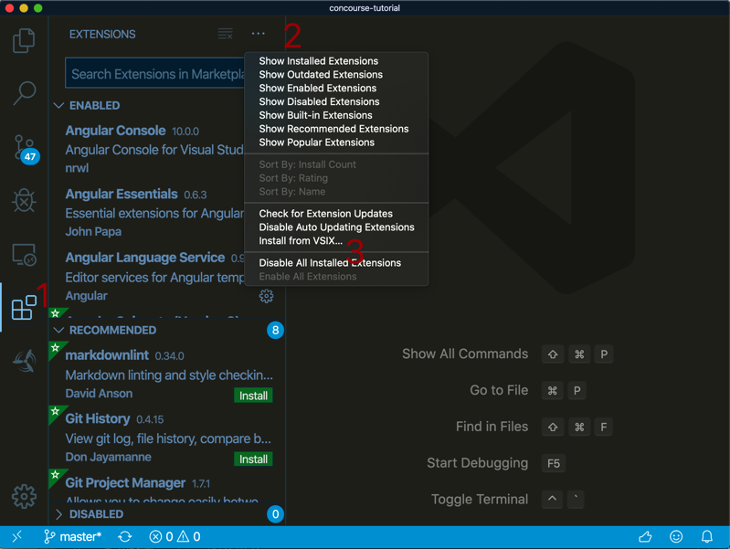
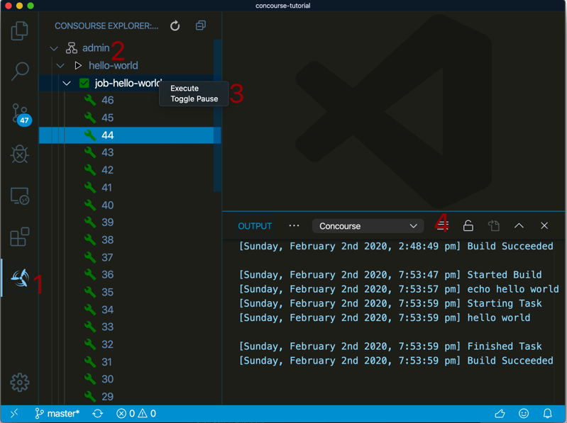

# Concourse Vsisual Studio  Code Extention

An extention to connect to  Concourse CI https://concourse-ci.org

## Features

Tree view of the concourse pipeines

## Install

1. Download the [vscode-concourse-0.0.1.vsix](https://github.com/pivotal-Jay-Wilson/concourse-extension/releases/download/v0.0.0.1/vscode-concourse-0.0.1.vsix) from releases on github.
2. Select Extensions (Ctrl + Shift + X) (1)
3. Open “More Action” menu(ellipsis on the top) and click “Install from VSIX…” (2)
4. Locate VSIX file and select.(3)

## Usage 

1. Make sure you can login using the fly cli.
2. Select the concourse icon. (1)
3. Open the team that you logged in with the cli. (2)
3. Expand the pipleine and right click the job you want to trigger. (3)
4. The poutput from the Job will appear in the concourse output window.(4)

## Requirements

You need to have the fly cli installed and logged on.
The extention looks for credentials in the home directory ifn the .flyrc file

## Known Issues

none so far

## Release Notes

alpha release

